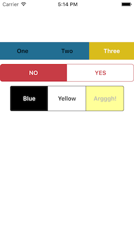
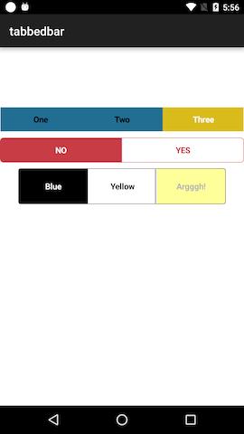

#Tabbed Bar Widget

Cross-platform segmented control (TabbedBar) widget for Appcelerator Titanium apps, by @skypanther




This is an Alloy widgetized version of my old segmented control component with some updated code and options.

Note: This widget uses a custom component on both iOS and Android. In other words, it does not fall back to Ti.UI.iOS.TabbedBar.

## Installation and usage

### Recommended

```shell
$ gittio install com.skypanther.segmentedcontrol
```

###Manual method (works, but why not use gittio?):

1. Download this repo (git clone, zip, whatever)
2. Copy the widgets/com.skypanther.segmentedcontrol to your project's widgets folder
3. Update your app/config.json to add:

```json
"dependencies": {
    "com.skypanther.segmentedcontrol": "1.0.1"
}
```

In your XML file, add the widget:

```xml
<Widget src="com.skypanther.segmentedcontrol" id="tbar" top="100"/>
```

Add styling as desired in your tss:

```
"#tbar": {
	borderRadius: 6,
	borderColor: "#C73C45",
	selectedButtonColor: "#C73C45",
	unselectedButtonColor: "#fff", 
	selectedButtonTextColor: "#fff",
	unselectedButtonTextColor: "#C73C45",
	index: 0,
	withDividers: true,
	font: {
		fontWeight: 'bold',
		fontSize: '15'
	}
}
```

Initialize it in the controller:

```javascript
$.tbar1.init(['One', 'Two', 'Three'], callback);

function callback(e) {
	alert('You clicked button ' + (e.index+1));
}
```

## Styling options

You can set these style options in the TSS or in your XML tag.

|Property|Description|Default|
|-------|---|-----------|
|`selectedButtonColor`|background color of the<br/>selected button|`#d9bc1b` (yellow)|
|`unselectedButtonColor` |background color of buttons<br/>that are not selected |`#226e92` (blue) |
|`selectedButtonTextColor` |color of text on the selected<br/>button |`#fff` |
|`unselectedButtonTextColor` |color of text on unselected<br/>buttons | `#000`|
|`disabledTextColor `|color of text on a disabled<br/>button | `#aaa` (light grey)|
|`disabledButtonBackgroundColor` |background color of a<br/>disabled button | `#444` (dark grey)|
|`font` | font properties of the button<br/>labels | `{fontFamily: 'Avenir-Light', fontSize: 11}` (ios)<br/>`{fontWeight: 'normal', fontSize: '15dp'}` (android)| 
|`withDividers`|whether to add dividers between button (color matches selected backgroundcolor)|`false`|

Additionally, most other properties you set on the widget (via its xml tag or id/class selectors) will be passed down to the widget's components.

## Methods

|Method|Notes|
|-------|--------------|
|`init(labels, callback)`|You must call this method to initialize the control, passing to it an array of labels and a function to be called when a button is tapped. That function will receive an object whose `index` property is the number of the button that was tapped|
|`select(num)`| Selects the button specified|
|`setIndex(num)`| Synonym for `select()`|
|`deselect(num)`| Deselects (unselects) the button specified|
|`enable()`| Enables click events for the whole control|
|`disable()`| Disables click events for the whole control|
|`deselectAll()`|Deselects all the buttons in the control|
|`disableButton(num)`|Disables the specified button, making it unclickable while the rest remain clickable|
|`enableButton(num)`|Enables the specified button, making it clickable.|
|`disableAllButtons()`|Disable all buttons, making them all unclickable. Essentially the same as `disable()`|
|`enableAllButtons()`|Enable all buttons, making them all clickable unless you have called `disable()`. In that case, you'd need to call `enable()`|

# History

* 16-Feb-2016: Ver 1.0.3 resolves last button in set not filling entire area on iPhone 6s+
* 08-Feb-2016: Ver 1.0.2 resolves issue where selecting/setIndexing a button didn't deselect the other buttons
* 05-Feb-2016: Ver 1.0.1 resolves layout issues on larger iOS devices when using percentage-based widths
* 29-Jan-2016: Initial release of the widget-ized version of my old Classic-style component
* Ancient history, like 2011, initial release with a few interim releases thereafter

# Limitations

* I have not tested this with more than 3 buttons. Too many and it will surely fail. 
* I haven't tested it on a tablet. Layout might be screwed up.
* I'm pretty sure it won't handle rotation of the device well.
* It doesn't support anything fancy, like icons instead of text on the buttons. Note: _it will support icon fonts for your text labels, so you can achieve a similar effect._

Contributions are welcome!

#License / Copyright

&copy; 2016 Tim Poulsen

MIT licensed